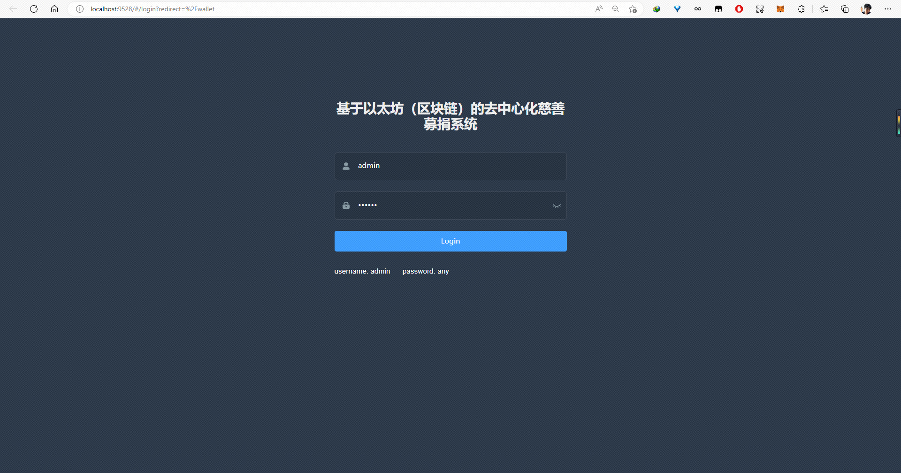

# cf_web

[English](./README.md) | 简体中文

基于以太坊（区块链）的众筹系统合约

* solidity 合约: <https://github.com/dengjiawen8955/cf_eth>

相关文档

* vue: <https://vuejs.bootcss.com/guide/instance.html>
* web3.js: <https://learnblockchain.cn/docs/web3.js/>
* vue-admin-template: <https://panjiachen.github.io/vue-element-admin-site/zh/guide/>
* element-ui: <https://element.eleme.cn/#/zh-CN/component/installation>

## 快速开始

```bash
npm install 
npm run dev
```

## 界面展示




